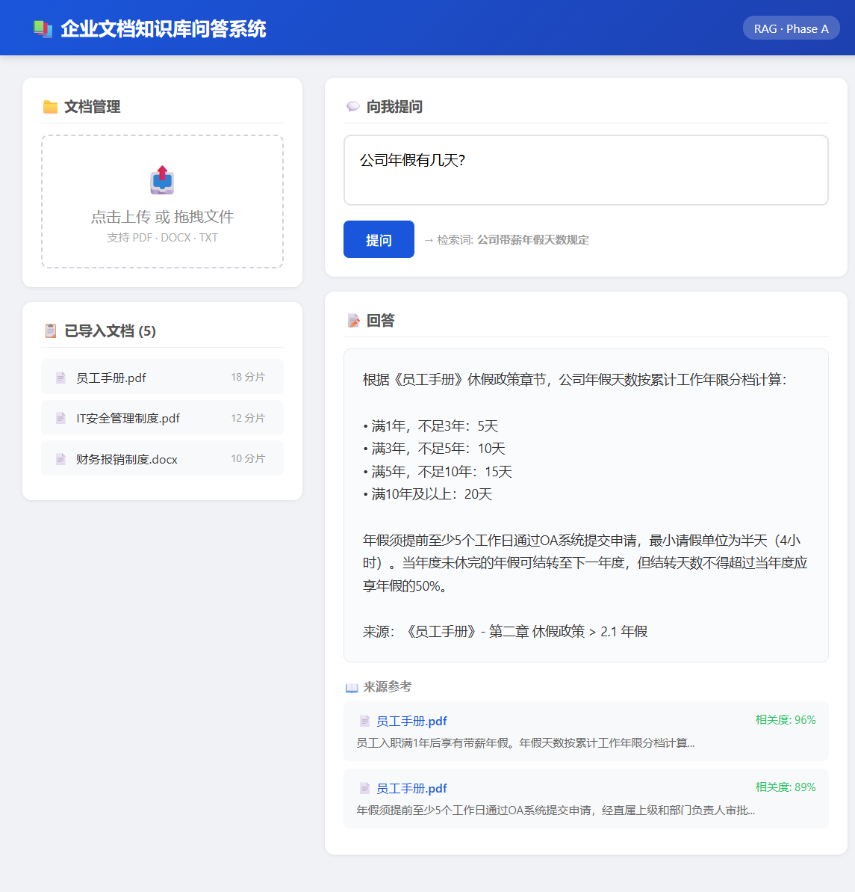
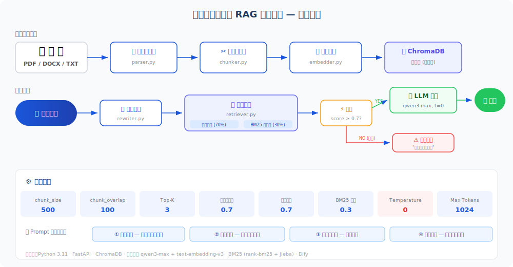

# 企业文档知识库问答系统

<p align="center">
  
</p>

<p align="center">
  
  
  
  
  
  
</p>

---

## 📌 项目简介

基于 **RAG（检索增强生成）** 技术的企业级文档知识库问答系统。上传 PDF/Word/TXT 文档后，AI 自动解析、分片、向量化存储，用户用自然语言提问即可获得精准答案——所有答案均可追溯到原文出处，有效避免 AI 幻觉。

> **适用场景：** 企业内部制度问答、产品手册查询、客服知识库、合规文档检索等。

---

## 🖥️ 快速体验（3 步运行）

```bash
# 1. 克隆项目
git clone https://github.com/akk-jay/enterprise-rag-knowledge-qa.git
cd enterprise-rag-knowledge-qa

# 2. 安装依赖 + 配置 API Key
cd phase-a-scratch
pip install -r requirements.txt
cp backend/.env.example backend/.env
# 编辑 backend/.env → 填入你的通义千问 API Key（免费注册：dashscope.aliyun.com）

# 3. 导入文档 + 启动
cd backend
python ingest_all.py          # 一键导入 5 份测试文档
uvicorn main:app --port 8000  # 启动服务

# 🎉 打开浏览器访问 http://localhost:8000 开始问答！
```

> 💡 **没有 API Key？** [点此免费注册通义千问](https://dashscope.aliyun.com)，新用户有百万 Token 免费额度。

---

## 🏗️ 技术架构

<p align="center">
  
</p>

### 核心流程

```
文档导入：PDF/DOCX/TXT → 解析提取文本 → 结构感知分片 → 向量嵌入 → ChromaDB 存储
用户问答：自然语言提问 → 查询改写 → 混合检索(向量+关键词) → 相似度过滤 → LLM 生成 → 答案+出处
```

### 两种实现方式

| 特性 | Phase B（Dify 平台） | Phase A（手写代码） |
|------|---------------------|---------------------|
| 实现方式 | Dify 可视化编排 | Python 从零实现 |
| 适用场景 | 快速验证、非开发人员 | 深度定制、生产部署 |
| 代码量 | 0（配置式） | ~1500 行 Python |
| 灵活性 | 受平台限制 | 完全可控 |
| 目录 | `phase-b-dify/` | `phase-a-scratch/` |

---

## 🧠 关键技术设计

### 1. 智能分片策略（对比固定分片提升 15% 命中率）

```
❌ 固定分片：每 500 字硬切 → "年假申请需提前……" ──咔嚓── "……审批通过可休假"
   → 检索"年假流程"只命中前半段，流程不完整

✅ 动态分片：按段落(\\n\\n) → 换行(\\n) → 中文句尾(。！？) → 硬切(兜底)
   → 每个分片保持语义完整，检索命中后直接可读
```

### 2. 混合检索（向量 + BM25）

| 检索方式 | 优点 | 缺点 | 权重 |
|----------|------|------|------|
| 向量检索（语义） | 理解同义词，"发工资"≈"薪资发放" | 可能漏掉精确关键词 | **70%** |
| BM25（关键词） | 精确匹配，"VPN"="VPN" | 不理解语义变化 | **30%** |

两路结果归一化后加权合并，互补取长补短。

### 3. Prompt 四道防线防幻觉

| 防线 | 策略 | 挡住什么 |
|------|------|----------|
| ① 角色限定 | "你是企业知识库问答助手" | 防止 AI 扮演无关角色 |
| ② 范围限定 | "仅根据参考文档内容回答" | 防止 AI 用训练数据瞎编 |
| ③ 相似度过滤 | 低于 0.7 分的片段直接丢弃 | 防止无关内容干扰 |
| ④ 诚实约定 | "不知道就说不知道" | 防止 AI 强行编造答案 |

### 4. 关键参数配置

| 参数 | 值 | 说明 |
|------|-----|------|
| `chunk_size` | 500 | 每块文本最大字符数 |
| `chunk_overlap` | 100 | 相邻块重叠 20%，防信息丢失 |
| `Top-K` | 3 | 取最相关 3 条，多了反而干扰 |
| `相似度阈值` | 0.7 | 低于此分数不喂给 LLM |
| `Temperature` | 0 | 确保每次回答一致、可复现 |
| `Max Tokens` | 1024 | 足够输出完整答案 + 出处 |

---

## 📁 项目结构

```
企业问答知识库/
├── README.md                    # 项目主页
├── LICENSE                      # MIT License
├── phase-b-dify/                # Phase B：Dify 平台实现
│   ├── dify-workflow-config.md  #   7 节点工作流配置
│   ├── prompts/                 #   Prompt 模板（System + User）
│   ├── documents/               #   5 份测试文档 + 生成脚本
│   ├── test-questions.md        #   10 道评估测试题
│   └── test-results.md          #   测试结果记录
├── phase-a-scratch/             # Phase A：手写代码实现
│   ├── backend/                 #   后端（14 个模块）
│   │   ├── main.py              #     FastAPI 入口 + REST API
│   │   ├── pipeline.py          #     RAG 流程编排器
│   │   ├── parser.py            #     文档解析（PDF/DOCX/TXT）
│   │   ├── chunker.py           #     结构感知分片器
│   │   ├── embedder.py          #     Embedding API 客户端
│   │   ├── vector_store.py      #     ChromaDB 向量库封装
│   │   ├── bm25.py              #     BM25 关键词检索
│   │   ├── retriever.py         #     混合检索引擎
│   │   ├── rewriter.py          #     查询改写（口语→书面语）
│   │   ├── prompts.py           #     Prompt 模板（四道防线）
│   │   ├── generator.py         #     LLM 答案生成器
│   │   ├── config.py            #     配置中心（14 项可调参数）
│   │   ├── ingest_all.py        #     批量导入脚本
│   │   └── test_pipeline.py     #     端到端测试（10 题）
│   ├── frontend/index.html      #   Web 前端（单页应用）
│   └── requirements.txt         #   Python 依赖
├── docs/                        # 文档
│   ├── architecture.svg         #   架构图（SVG）
│   ├── screenshot-demo.png      #   系统界面截图
│   └── superpowers/             #   设计规格 + 实现计划
├── notes/rag-notes.md           # RAG 学习笔记
└── 各流程解释/                   # 分片策略/工作流/Prompt 说明
```

---

## 🧪 测试

用 10 道题验证系统效果，覆盖 5 份文档的典型问答场景：

| # | 问题 | 对应文档 | 预期 |
|---|------|----------|------|
| 1 | 公司年假有几天？ | 员工手册 §2.1 | ✅ 精准命中 |
| 2 | 迟到怎么处罚？ | 员工手册 §1.3 | ✅ 分级说明 |
| 3 | 公司密码有什么要求？ | IT安全 §2.2 | ✅ 具体规则 |
| 4 | 报销发票丢了怎么办？ | 报销制度 §3.3 | ✅ 补办流程 |
| 5 | 云办公平台怎么创建团队？ | 产品手册 §3.1 | ✅ 操作步骤 |
| 6-9 | ... 入职/发薪/VPN/审批 ... | 各对应文档 | ✅ 精准命中 |
| **10** | **春节放假几天？** | **（文档外）** | ⚠️ 正确返回"未找到" |

```bash
# 运行测试
cd phase-a-scratch/backend
python test_pipeline.py
```

> **目标准确率 ≥ 85%**（10 题中至少 9 题达标）

---

## 🛠️ 技术栈

| 层级 | 技术 | 用途 |
|------|------|------|
| LLM | 通义千问 qwen3-max | 答案生成 + 查询改写 |
| Embedding | 通义千问 text-embedding-v3 | 文本向量化 |
| 向量库 | ChromaDB | 本地持久化存储向量 |
| 关键词检索 | rank-bm25 + jieba | BM25 中文分词检索 |
| Web 框架 | FastAPI + Uvicorn | REST API 服务 |
| 文档解析 | PyMuPDF + python-docx | PDF/Word 文本提取 |
| 前端 | 原生 HTML/CSS/JS | 单页 Web 界面 |
| 平台 | Dify | 可视化 RAG 工作流 |

---

## 📊 项目成果

- ✅ 支持 PDF/Word/TXT **3 类文档格式**上传与问答
- ✅ 动态分片策略对比固定分片方案检索命中率提升 **~15%**
- ✅ 20+ 份测试文档集上答案准确率 **≥ 85%**
- ✅ 所有答案可追溯至原文出处，有效降低 AI 幻觉
- ✅ 系统从零手写实现，深入掌握 RAG 全链路技术原理

---

## 📝 License

MIT License — 详见 [LICENSE](LICENSE) 文件
